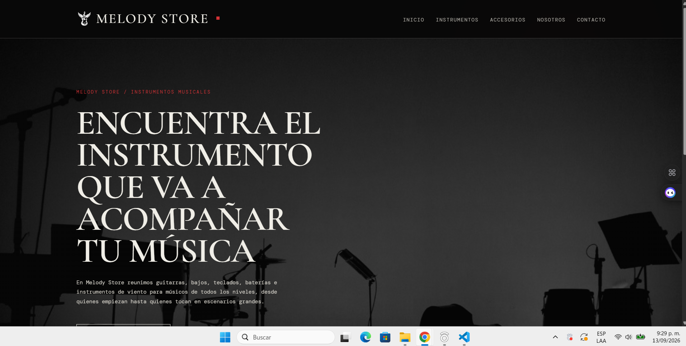

# Melody Store

## Descripción

Melody Store es un sitio web estático para una tienda de instrumentos
musicales y accesorios. La página está pensada para estudiantes, músicos y
bandas que quieren revisar opciones de equipo de una forma clara y sencilla.

El proyecto muestra los productos con su nombre, descripción, precio e imagen.
La página principal funciona como una bienvenida a la tienda y cada opción del
menú abre su propio documento HTML en la misma pestaña. De esta manera, el
catálogo, los accesorios, la información de la tienda y el formulario de
contacto. Podria estar en una sola pagina todo redireccionando en esa misma pagina, pero decidi que redireccionara en otras páginas para que se viera mas organizado y más compelto.

## Funcionalidades

- Página de inicio con imagen de fondo, presentación de la tienda y enlaces al catálogo.
- Página independiente para instrumentos.
- Página independiente para accesorios.
- Página independiente con información sobre Melody Store.
- Página independiente de contacto con formulario validado en el navegador.
- Catálogo dinámico creado desde un arreglo de productos en JavaScript.
- Filtros por categoría para guitarras, bajos, teclados y baterías.
- Imágenes PNG locales para el logo, las categorías y los productos.
- Diseño responsive para escritorio, tablet y móvil.
- Navegación con rutas relativas, sin depender de un servidor backend.

## Tecnologías

- HTML5 para la estructura de las páginas.
- CSS3 para los estilos, la composición visual y el diseño responsive.
- JavaScript puro para el catálogo, los filtros, el menú y la validación.
- Git y GitHub para controlar y publicar el código fuente.
- Vercel para alojar el sitio estático.

No se utilizaron frameworks ni librerías de JavaScript. El proyecto no necesita
Node.js, una base de datos ni un servidor backend para funcionar.

## Estructura del proyecto

```text
Melody-store/
├── index.html          # Página principal
├── instrumentos.html   # Catálogo de instrumentos
├── accesorios.html     # Catálogo de accesorios
├── nosotros.html       # Información sobre la tienda
├── contacto.html       # Formulario de contacto
├── styles.css          # Estilos generales y responsive
├── script.js           # Productos, filtros, menú y validación
├── img/                # Logo, fondo y fotos de productos
└── README.md           # Documentación del proyecto
```

Todas las páginas cargan `styles.css` y, cuando necesitan comportamiento,
cargan `script.js`. Las imágenes se encuentran dentro de `img/` y se llaman
mediante rutas relativas como `img/guitarra_electrica.png`. Esto permite que el
proyecto funcione igual en local, en GitHub y en Vercel.

## Cómo funciona el sitio

### Página principal

`index.html` contiene la portada de Melody Store. Incluye el fondo `fondo.png`,
el mensaje principal y enlaces directos a las páginas de instrumentos y
contacto. La portada no repite todo el catálogo; su objetivo es presentar la
tienda y dirigir al visitante a la sección que necesita.

### Navegación entre páginas

El menú usa enlaces HTML normales:

- `index.html` para Inicio.
- `instrumentos.html` para Instrumentos.
- `accesorios.html` para Accesorios.
- `nosotros.html` para Nosotros.
- `contacto.html` para Contacto.

Los enlaces no abren ventanas nuevas. El navegador cambia de documento en la
misma pestaña y todas las rutas son relativas al proyecto.

### Catálogo dinámico

Los productos están definidos en el arreglo `productos` de `script.js`. Cada
objeto contiene su nombre, categoría, precio, descripción y ruta de imagen.
Cuando se carga una página con contenedores de productos, JavaScript recorre el
arreglo y genera las tarjetas automáticamente.

Los botones de filtro cambian la categoría seleccionada y muestran únicamente
los productos que corresponden. Esto evita repetir manualmente la misma tarjeta
en el HTML.

### Formulario de contacto

El formulario se encuentra en `contacto.html`. JavaScript comprueba que los
campos estén completos y valida el nombre, el correo, el teléfono y la longitud
del mensaje. Los errores aparecen junto al campo correspondiente.

Actualmente el formulario es una demostración del lado del cliente: muestra un
mensaje de confirmación, pero todavía no envía datos a un correo ni a una base
de datos porque el proyecto no tiene un backend conectado.

## Mis decisiones técnicas

### ¿Dónde usé Flexbox y dónde Grid?

Usé Flexbox principalmente en el encabezado, el menú, los botones y los filtros.
En esos lugares los elementos se organizan en una fila o una columna y deben
acomodarse con facilidad cuando cambia el tamaño de la pantalla. Por ejemplo,
el menú se muestra horizontalmente en escritorio y se convierte en un menú
hamburguesa en móvil.

Usé Grid para distribuir las categorías y las tarjetas de productos. Grid me
permitió controlar mejor el número de columnas: en una pantalla grande se pueden
ver varias tarjetas juntas y en una pantalla pequeña se reducen las columnas
para que las imágenes y los textos no queden apretados.

### ¿Qué hace mi JavaScript?

Mi JavaScript se encarga de generar las tarjetas del catálogo a partir de una
lista de productos. También permite filtrar por categoría, abrir y cerrar el
menú móvil y validar el formulario de contacto.

La validación revisa que ningún campo obligatorio quede vacío. Además comprueba
que el nombre tenga una longitud mínima, que el correo tenga un formato válido,
que el teléfono contenga una estructura aceptable y que el mensaje tenga la
longitud necesaria. Cuando hay un error, se muestra una indicación junto al
campo correspondiente y el usuario puede corregirlo sin recargar la página.
Si los datos cumplen las condiciones, aparece un mensaje de confirmación.

### ¿Usé inteligencia artificial?

Sí, me apoye de la IA para organizar ciertas partes del código que no se organizaban correctamente,
debido a que tuve problemas con unas imagenes tambien me apoye en esto un poco mediante una explicación,
la mejora de la tipografia debido a que la cambie y queria un analisis de cual se veria mejor,
ordenar correctamente mi documentación.

### ¿Qué fue lo más difícil y cómo lo resolví?

Lo más difícil fue organizar la navegación y el catálogo sin repetir el mismo
contenido en todas las páginas. Primero separé Inicio, Instrumentos,
Accesorios, Nosotros y Contacto en documentos HTML independientes. Después dejé
los productos en un solo arreglo de JavaScript para que las tarjetas se creen
automáticamente donde se necesitan.

También fue necesario corregir las rutas de las imágenes, porque el código
apuntaba a archivos SVG que no estaban en la carpeta `img`. Revisé los nombres
reales de las imágenes PNG y actualicé las referencias. Finalmente comprobé que
las rutas fueran relativas para que el sitio funcionara tanto en local como en
Vercel.

### Diseño responsive y organización de imágenes

El archivo `styles.css` incluye media queries para tablet y móvil. En pantallas
pequeñas el menú se convierte en un botón hamburguesa, la información se apila
y las tarjetas ocupan el ancho disponible.

Las imágenes se guardan dentro de `img/` y se referencian con sus nombres reales
en formato PNG. De esta forma no dependen de rutas externas ni de archivos que
no formen parte del proyecto.

## Cómo ejecutar el proyecto en local

Como es un sitio HTML/CSS/JavaScript puro, se puede abrir `index.html` en el
navegador. Para probarlo de una forma más parecida a un servidor web, se puede
usar el servidor incluido en Python:

```powershell
cd "C:\Users\admin\Pictures\Melody-store"
python -m http.server 8000
```

Después se visita:

```text
http://localhost:8000
```

Para detener el servidor local se presiona `Ctrl + C`. Este servidor solo se
usa para probar el proyecto; el sitio no depende de `localhost` cuando se
publica.

## Cómo desplegarlo en Vercel

1. Crear un repositorio en GitHub.
2. Subir todos los archivos del proyecto, incluyendo la carpeta `img/`.
3. Entrar a Vercel e iniciar sesión con GitHub.
4. Elegir **Add New Project** y seleccionar el repositorio de Melody Store.
5. Mantener la configuración predeterminada, porque no hay proceso de build.
6. Presionar **Deploy**.
7. Copiar la URL generada por Vercel y agregarla en la sección **Sitio
	publicado** de este README.

No es necesario configurar comandos de instalación, frameworks ni variables de
entorno para este proyecto.

## Sitio publicado en Vercel

El proyecto está publicado en Vercel y se puede visitar en el siguiente enlace:

[Melody Store en Vercel](https://melody-store-five.vercel.app/)

## Capturas

### Escritorio



### Móvil


